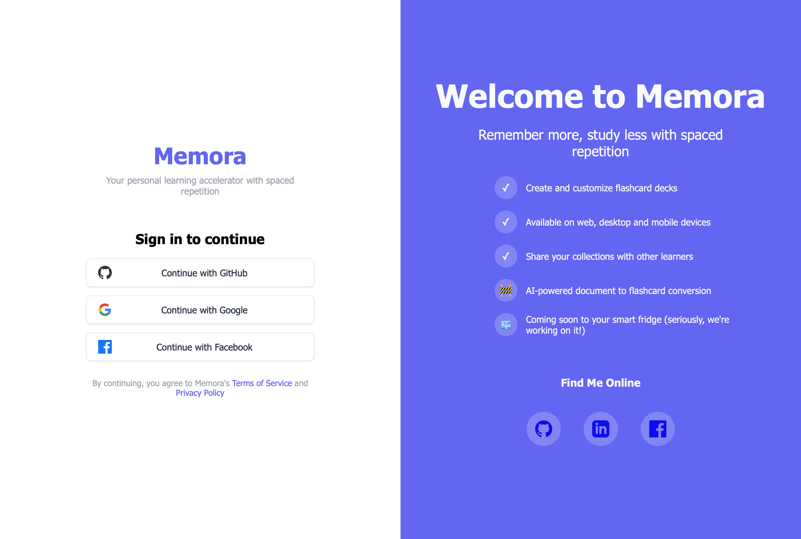
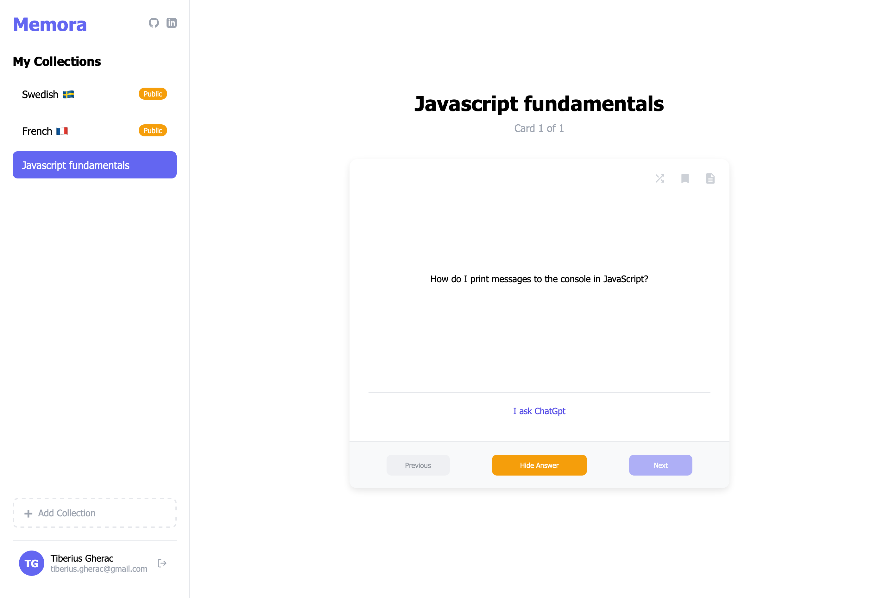

# Memora Frontend

A modern flashcard application built with Web Components, featuring Firebase authentication and a clean, responsive interface.

## 🚀 Features

- **Authentication**: Multi-provider login (Google, GitHub, Facebook) with Firebase Auth. With account linking between different providers.
- **Collection Management**: Create, edit, and organize flashcard collections
- **Review Modes**: Sequential and random card review with bookmark functionality
- **Public Collections**: Browse and add community-created flashcard sets
- **Settings**: Comprehensive collection and card management
- **Responsive Design**: Works seamlessly across desktop and mobile devices but mainly developed with desktop interface in mind for now.

## Tech Stack

- **Frontend**: Vanilla JavaScript with Web Components
- **Authentication**: Firebase Auth
- **Styling**: CSS with shadow DOM encapsulation
- **Build Tool**: Vite
- **Containerization**: Docker

<br/>

## Getting Started

### Prerequisites

- Node.js
- npm
- Docker (optional)

### Local Development

1. **Clone the repository**

   ```bash
   git clone https://github.com/Memora-Tiberiusgh/frontend.git
   cd frontend
   ```

2. **Install dependencies**

   ```bash
   npm install
   ```

3. **Environment Setup**
   Create a `.env` file in the root directory

   ```env
   VITE_API_BASE_URL=your_backend_api_url
   ```

4. **Start development server**
   ```bash
   npm run dev
   ```
   The application will be available at `http://localhost:5173`

<br/>

### Docker Development & Production

The application can be containerized for both development and production environments. The easiest way to run the complete Memora stack (frontend, backend, and database) is through the docker-compose file provided in the orchestrator repository:

**Using Docker Compose (Recommended):**

```bash
# Clone the orchestrator repository
git clone https://github.com/Memora-Tiberiusgh/orchestrator
cd orchestrator

# Follow the setup instructions in the orchestrator README
# This will start the entire Memora application stack
```

**Manual Docker Build (if needed):**

```bash
# Development
docker build -f Dockerfile.dev -t memora-frontend-dev .

# Production
docker build -f Dockerfile.prod -t memora-frontend-prod .
```

### Local Production Build

```bash
npm run build
npm run preview
```

## Firebase Configuration

The application uses Firebase for authentication with the following providers:

- Google OAuth
- GitHub OAuth
- Facebook OAuth

Firebase configuration is located in `src/services/firebase.js`. Update the configuration object with your Firebase project credentials.

## API Integration

The application communicates with Memora's backend API. Set the VITE_API_BASE_URL environment variable to your API endpoint.
For backend setup and documentation, see the [Memora Backend Repository](https://github.com/Memora-Tiberiusgh/backend).

**API Endpoints Used:**

- `GET /api/v1/collections` - Fetch user collections
- `POST /api/v1/collections` - Create new collection
- `GET/POST/PATCH/DELETE /api/v1/flashcards` - Manage flashcards
- `GET /api/v1/collections/public` - Browse public collections
- `POST /api/v1/users` - User creation/update

## Component Architecture

The application is built using native Web Components with Shadow DOM for style encapsulation:

- **memora-app**: Root application component handling routing and authentication
- **memora-login**: Authentication interface with multiple OAuth providers
- **memora-main**: Main dashboard with collection management
- **memora-collection**: Collection creation wizard
- **memora-review**: Flashcard study interface
- **memora-settings**: Collection and flashcard management
- **memora-public**: Public collections browser

## Development Guidelines

- Components use Shadow DOM for style encapsulation
- Event-driven communication between components
- No external frameworks - vanilla JavaScript only

## Screenshots & Demo

### Login interface


_Main login interface_

### Review Interface


_Flashcard review interface with bookmark and random mode features_

### Demo gif


_A gif showcasing the application interface_

## 🤝 Contributing

1. Fork the repository
2. Create a feature branch
3. Make your changes
4. Test thoroughly
5. Submit a pull request

## License

This project is licensed under the MIT License.

## Support

For issues and feature requests, please visit our [GitHub Discussions](https://github.com/orgs/Memora-Tiberiusgh/discussions) or contribute to the project at [GitHub organization](https://github.com/Memora-Tiberiusgh).

## Author

**Tiberius Gherac** - [tiberius.gherac@gmail.com](mailto:tiberius.gherac@gmail.com)  
First-year Web Development Student @ Linnaeus University  
GitHub: [@TiberiusGh](https://github.com/TiberiusGh)

---
